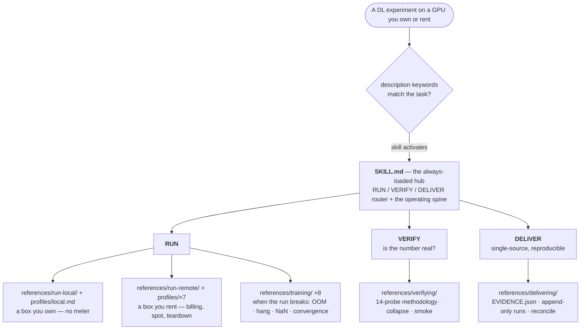
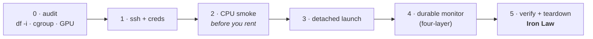

# remote-gpu-trainer

An Agent Skill for the **whole life of a DL experiment** — **RUN** a job (on a GPU you own *or* rent),
**VERIFY** that the number is real, and **DELIVER** it as organized, single-source, reproducible figures
and tables. Its deepest part is still remote-GPU operations (AutoDL, RunPod, vast.ai, Lambda, Paperspace,
the Chinese platforms 恒源云 / 矩池云 / Featurize / 揽睿星舟, bare SSH, Slurm, Kubernetes — one instance or
a fan-out of many), now wrapped in the full run → verify → deliver arc.

[](LICENSE)
[](https://agentskills.io)
[](https://agentskills.io/specification)
[](#whats-inside)
[](#whats-inside)
[](#verification-status)

> **What this is, and what it isn't.** "AutoDL" here means the [autodl.com](https://www.autodl.com)
> GPU-rental platform, not AutoML or NAS. And this is an Agent Skill — a `SKILL.md` with reference docs and
> script templates, not a CLI or an SDK. It sits on top of each platform's API and the DL workflow, and
> captures the operational and judgment knowledge they leave out.

One skill, three phases of one real workflow:

- **RUN** — get a long GPU job to start, survive, and finish, then get the result off the box. On a
  machine **you own** there is no meter; on a **rented** one the core insight is that you are a short-term
  tenant on someone else's machine — so the job is to detach the work, make the result outlive the
  instance, and stop the meter safely. The things that genuinely vary between platforms (stop-vs-destroy
  billing, machine-locked volumes, whether `/root` survives a power-off, acceleration proxy vs HF mirror,
  spot grace windows) are pushed down into one profile per platform.
- **VERIFY** — *is this number a bug, a real effect, or noise?* A surprising result is a hypothesis, not a
  fact to report. Platform-agnostic.
- **DELIVER** — organize the result so every shipped number / figure / table is a deterministic function
  of one immutable evidence layer; provenance and cross-document consistency are locked by mechanism, not
  by a human remembering to update three documents. Platform-agnostic.

Two stances run through VERIFY and DELIVER: **user sovereignty** (the science — seed count, which samples,
whether an `aux` channel exists — is your call; the skill organizes and discloses a tradeoff once, then
stops nagging) and **audit → disclose, not enforce** (an integrity issue must surface with the conclusion
it affects, but the skill never blocks you from shipping). Mantra: *disclose it, or don't claim it.*



## Contents

[Why this exists](#why-this-exists) · [How it differs](#how-it-differs) ·
[Architecture and layout](#architecture-and-layout) · [Install and deploy](#install-and-deploy) ·
[What's inside](#whats-inside) · [Scope](#scope) · [Verification status](#verification-status) ·
[Disclaimer](#disclaimer) · [中文简介](#中文简介) · [Contributing](#contributing) ·
[License](#license) · [Citing](#citing)

## Why this exists

Renting the GPU is the easy part; so is starting a training run. The costly surprises are everything
*around* the job — and they don't stop when the job finishes. A box you "stopped" that keeps billing. A
checkpoint that printed `synced` but never actually wrote, because the disk ran out of inodes rather than
space. A download that hangs behind the wrong mirror. A `terminate` that takes the only copy of a week's
training with it. Then, *after* the run: a 1.2 % "win" that is really a misconfigured baseline; a leaked
test split that survives every shallow check; a headline number left stale in the slides because the fix
only landed in the paper. None of this is in any platform's API docs, and you usually learn it after you
have already paid — in money, or in a claim you have to retract.

This skill puts that knowledge where an agent can use it: operating principles that say why each step
matters, a six-phase lifecycle where every phase ends in a check you can run, one profile per platform
with the exact commands, a probe-by-probe methodology for deciding whether a number is real, and an
evidence-layer architecture that makes a stale or hand-typed number physically impossible to ship. It
spends its attention on the things that cost money, data, or a retraction.

## How it differs

The infrastructure orchestrators (SkyPilot, dstack, Modal) own or abstract the box and price-shop across
Western clouds. They are good at that, this skill does not compete with them, and the two go together —
let SkyPilot or dstack move the box, then use this skill to make your code resume correctly so recovery
*continues* the run instead of restarting it. Two things set this apart:

1. **It works on the raw rented instance you already have, including the platforms they skip.** AutoDL and
   the Chinese platforms, and cheap bare-SSH rentals, where the day-to-day work is disk budgeting, inode
   caps, mirror stalls, cgroup OOM, spot grace windows, and teardown you cannot take back — none of which
   the orchestrators model.
2. **It does not stop at "the job ran."** They hand you a finished run; this skill continues into *is the
   number real* (VERIFY) and *is the deliverable reproducible from one evidence layer* (DELIVER) — the
   part of the experiment lifecycle the infra tools do not enter at all. That is the half most likely to
   cost you a correction after submission, and it is the half they leave entirely to you.

## Architecture and layout

The layout uses the Agent Skills idea of progressive disclosure: a small hub that is always loaded, with
the deeper material read in only when a phase needs it. RUN is **platform-specific at the edges** (one
profile per platform owns every concrete path, proxy, billing verb, and spot rule) and **invariant at the
core**; VERIFY and DELIVER are platform-agnostic and run the same whether the job trained locally or on a
rental.

The remote-RUN third has a six-phase operational spine; each phase delegates its platform details to the
active profile and ends in a check you can run:



The folders map onto RUN → VERIFY → DELIVER:

```text
remote-gpu-trainer/
├── SKILL.md                       # the hub: RUN/VERIFY/DELIVER router + the operating spine
├── references/                    # platform-agnostic knowledge, loaded on demand
│   ├── run-local/                 #   RUN, a box you own: env-hygiene · launch · multi-gpu · local-oom
│   ├── run-remote/                #   RUN, a box you rent: principles · 6-phase checklist · monitoring ·
│   │                              #     ssh · spot-resilience · china-network · parallel-ablation ·
│   │                              #     multinode · gotchas_universal (U1–U43)
│   ├── verifying/                 #   VERIFY: methodology (14 probes) · representation-collapse ·
│   │                              #     smoke-hidden-failures
│   ├── delivering/                #   DELIVER: principles · data-architecture (EVIDENCE.json) ·
│   │                              #     evidence-manifest-schema · figures · delivery-gate
│   ├── training/                  #   the DL-training debug layer (8 files; local/remote-agnostic):
│   │                              #     OOM · NCCL-hang · NaN · throughput · ckpt · domain · convergence · data
│   ├── companions.md              #   optional companion skills + the no-companion fallback
│   └── self-improvement.md        #   how the skill captures new gotchas without corrupting itself
├── profiles/                      # one file per platform — the only place concrete specifics live
│   ├── _schema.md                 #   the shared 8-field contract every profile fills
│   ├── local.md                   #   a box you own (no meter, no teardown clock)
│   ├── autodl.md                  #   deepest, battle-tested
│   ├── runpod.md  vastai.md  lambda.md  paperspace.md
│   ├── china.md                   #   恒源云 / 矩池云 / Featurize / 揽睿星舟
│   └── generic-ssh.md             #   bare SSH / Slurm / K8s / Colab-Kaggle
├── scripts/                       # parameterized, runnable templates
│   ├── run_one.sh.template  run_queue.sh.template  health_patrol.sh.template
│   ├── mem_monitor.sh  gpu_health.sh  reap_vram_zombies.sh
│   ├── aggregate_to_fs.sh  download_loop.sh  setup-china-mirrors.sh
│   ├── verify_local.py            #   load-and-verify each artifact before any teardown
│   ├── reconcile.py  manifest_scaffold.py  repro.sh.template   # the DELIVER evidence tooling
│   └── wandb_forensics.py  check_staleness.py
├── examples/autodl_sweep/         # one complete worked case, end to end
└── evals/                         # cases.jsonl + run_evals.py (no-API-key drift guard) + RESULTS.md
```

Each profile fills the same eight fields, so a platform you have never used reads like one you have:
launch, storage survival-matrix, network, spot/resume, teardown/billing, daemon, gotchas, and script
overrides.

## Install and deploy

This is a standard [Agent Skill](https://agentskills.io): one folder with a `SKILL.md` at its root. To
install it, clone the folder into wherever your agent looks for skills and restart the agent. It triggers
on its own for the run / verify / deliver tasks above, so you do not call it by name. Keep the folder
named `remote-gpu-trainer`, since the standard requires the directory name to match the skill's `name:`
field.

**Claude Code**

```bash
git clone https://github.com/Hanyuyuan6/remote-gpu-trainer.git ~/.claude/skills/remote-gpu-trainer
```

**OpenAI Codex**

```bash
git clone https://github.com/Hanyuyuan6/remote-gpu-trainer.git ~/.agents/skills/remote-gpu-trainer
```

**Cursor · Trae · Gemini CLI · VS Code / Copilot · Goose · Kiro · other compatible agents**

Clone the same folder into that agent's skills directory; each agent's docs, or
[agentskills.io](https://agentskills.io), give the exact location. They all read the same open `SKILL.md`
standard, so the folder works unchanged across them.

**Verify the install (optional).** With [uv](https://github.com/astral-sh/uv):

```bash
uvx --from skills-ref agentskills validate ~/.claude/skills/remote-gpu-trainer   # → "Valid skill"
```

> **Two caveats.** The optional companion skills it cross-links (`nature-figure`, `experiment-verifier`,
> `superpowers:*`, `huggingface-skills:*`) are separate installs, and the skill works fully standalone
> without any of them (see `references/companions.md`). A few of the durable-monitoring recipes assume the
> host has a background-task runner and a scheduler; map those to your agent's equivalents with the
> per-host table in `references/run-remote/monitoring_patterns.md` §7.

## What's inside

- **`SKILL.md`** is the hub: a thin RUN / VERIFY / DELIVER router, the load-bearing operating spine, the
  platform selector, the remote six-phase lifecycle with a runnable gate per phase, and the links into
  everything below.
- **`references/run-local/`** and **`references/run-remote/`** are the two RUN halves — owning a box (no
  meter; env hygiene, launch, single-node multi-GPU, local OOM) versus renting one (the six-phase
  lifecycle, four-layer durable monitoring, SSH transport, spot resilience, China networking, parallel
  ablation, multi-node, and the U1–U43 gotcha catalog, each a `symptom → root cause → fix`).
- **`references/verifying/`** is the *is-the-number-real* layer: a 14-probe methodology (bug / effect /
  noise classification, leakage, fair comparison, smoke ≠ correct, representation collapse, metric and
  statistical integrity, cross-document reconciliation, the academic-integrity spectrum) plus two deep
  playbooks.
- **`references/delivering/`** is the *deliverable* layer: make every shipped number a deterministic
  function of one immutable evidence layer (`EVIDENCE.json` single source of truth, append-only runs,
  generated-not-transcribed tables, the figure-chain pixel gate, a disclosure gate), with `reconcile.py`
  to catch cross-document drift.
- **`references/training/`** is the DL-training debug layer, eight files for when the *run* breaks rather
  than the platform: OOM, distributed launch and multi-GPU hangs, precision and loss spikes, throughput
  profiling, checkpoint/resume, per-domain gotchas, convergence ("runs but won't learn"), and dataloader
  correctness.
- **`profiles/`** is one file per platform, the only place concrete specifics live. `local` is a box you
  own; `autodl` is the deepest; alongside are `runpod`, `vastai`, `lambda`, `paperspace`, `china`, and
  `generic-ssh` (which also covers Slurm, K8s, Colab, and Kaggle). `_schema.md` defines the shared
  eight-field contract.
- **`scripts/`** has the parameterized wrapper templates, monitors (memory, GPU health, VRAM-zombie
  reaper, read-only health patrol), transfer (FS aggregation, resumable download, China-mirror setup), the
  load-and-verify checker, and the DELIVER tooling (`reconcile.py`, `manifest_scaffold.py`,
  `repro.sh.template`, `wandb_forensics.py`).
- **`examples/autodl_sweep/`** is one complete worked case from start to finish.
- **`evals/`** is a retrieval drift-guard. `cases.jsonl` holds realistic scenarios, `run_evals.py` checks
  with no API key that each scenario's answer is still at its documented location, and `RESULTS.md`
  records fresh-agent navigation runs.

## Scope

- **For:** the full lifecycle of a DL experiment — **RUN** (a GPU you own *or* rent: Chinese and Western
  clouds, bare SSH, Slurm, K8s; single or multi-instance; training, eval, ablation sweeps, batch
  inference, large data processing), **VERIFY** (deciding whether a result is a bug, a real effect, or
  noise — leakage, fair comparison, collapse, variance, cross-document drift), and **DELIVER** (organizing
  it into a single-source, reproducible set of figures and tables).
- **Not for:** managed multi-cloud price-shopping with auto spot-recovery across Western clouds (use
  **SkyPilot**'s skill), open BYOC dev environments (use **dstack**), or zero-ops serverless inference
  (use **Modal**). For in-instance multi-GPU launching, the skill tells you how to drive
  `torchrun` / `accelerate` / `deepspeed` — it does not replace them.

## Verification status

The **AutoDL** profile reflects the author's hands-on, daily use. The other six rental profiles (RunPod,
vast.ai, Lambda, Paperspace, the Chinese platforms, and the generic SSH / Slurm / K8s core) are researched
from each platform's official documentation and community reports. Every money-affecting fact is cited
inline and stamped `verified <month>`, but the author has not independently live-tested them yet, so treat
them as a well-sourced starting map rather than a guarantee. The VERIFY and DELIVER layers are
platform-agnostic methodology drawn from the author's own research practice.

The skill is built to verify before any costly or irreversible action (the Phase-0 live measurement and
the teardown Iron Law), so a stale fact shows up as "re-check the docs" instead of a silent loss.
Corrections, and "I ran this, here's what changed" reports, are very welcome; please open an issue or PR.

## Disclaimer

This is an independent community resource. It is not affiliated with, endorsed by, or sponsored by AutoDL,
RunPod, vast.ai, Lambda, Paperspace, DigitalOcean, or any platform named here. All product names and
trademarks belong to their respective owners and are used nominatively, only to identify the platform a
piece of guidance applies to. Platform facts are synthesized from public documentation and community
reports (cited inline) and were accurate at the noted `verified` date. Platforms change their pricing,
billing verbs, and limits, so verify against current official docs before relying on a teardown or billing
fact (see `references/self-improvement.md` §5). Provided "as is" under the MIT License, without warranty.

## 中文简介

一个覆盖深度学习实验**全生命周期**的 Agent Skill:**RUN**(在自己的或租来的 GPU 上把作业跑起来、跑完、
把结果取回)→ **VERIFY**(这个数到底是 bug、真效应、还是噪声)→ **DELIVER**(整理成单一真源、可复现的图
表)。它最深的部分仍是远程 GPU 运维 —— AutoDL、RunPod、vast.ai、Lambda、Paperspace、国内平台(恒源云 /
矩池云 / Featurize / 揽睿星舟)、裸 SSH、Slurm、Kubernetes,单机或多机并行 —— 如今被包进完整的
run → verify → deliver 链路。

RUN 的核心想法:在租来的机器上,你只是别人机器上的短期租客,所以要让作业 detach 扛得住断连、在实例消失
前把结果取下来、再安全地停掉计费;真正因平台而异的部分(停止与销毁的计费差别、锁定到机器的网盘、`/root`
是否在关机后保留、加速代理与 HF 镜像、spot 抢占宽限)都下沉到各自的 `profiles/<平台>.md`。VERIFY 与
DELIVER 与平台无关:前者判断一个数能不能信(泄漏、公平对比、表征崩塌、方差、跨文档对账),后者用机制把
"每个数都是不可变证据层的确定性函数"锁死,让 stale 数字物理上无法出门。两条贯穿原则:**用户主权**(科研判
断归你,skill 只组织并一次性披露 tradeoff,不唠叨)与**审查→披露而非拦截**(诚信问题必须随结论浮现,但绝
不阻断你交付)。安装见 [Install and deploy](#install-and-deploy):把整个文件夹克隆进对应 agent 的 skills
目录,重启后会自动触发。

## Contributing

Issues and PRs are welcome, especially new platform profiles and new gotchas that come with a concrete
`symptom → root cause → fix`. Keep every example generic, with no real project names, hostnames, IPs,
ports, or keys. The bar a new gotcha has to clear before it earns a place in the catalog (root-caused,
reproduced, generalizable) is described in `references/self-improvement.md`.

## License

MIT — see [LICENSE](LICENSE). Copyright (c) 2026 Yuyuan Han.

## Citing

A link back is plenty. If you need a formal reference:

```bibtex
@software{han_remote_gpu_trainer_2026,
  author = {Han, Yuyuan},
  title  = {remote-gpu-trainer: an Agent Skill for the DL experiment lifecycle on owned or rented GPUs},
  year   = {2026},
  url    = {https://github.com/Hanyuyuan6/remote-gpu-trainer}
}
```
