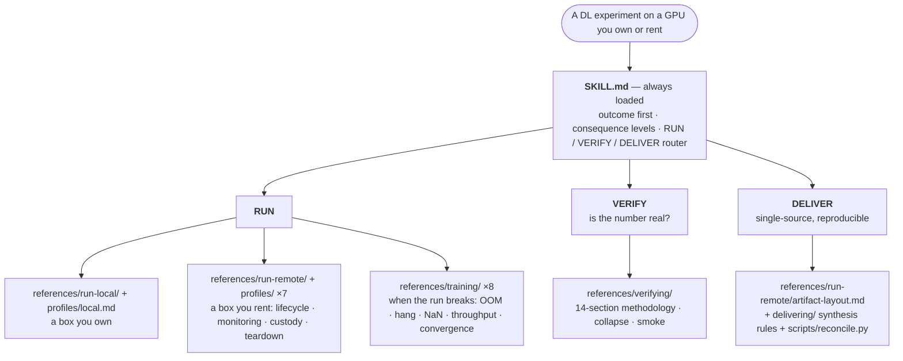

# remote-gpu-trainer

An [Agent Skill](https://agentskills.io) for the whole life of a deep-learning experiment: **RUN** a job on a
GPU you own or rent, **VERIFY** that the number is real, and **DELIVER** it as single-source, reproducible
figures and tables. Its deepest part is remote-GPU operations — AutoDL, RunPod, vast.ai, Lambda, Paperspace,
the Chinese platforms (恒源云 / 矩池云 / Featurize / 揽睿星舟), bare SSH, Slurm, Kubernetes, one box or a
fan-out of many — wrapped in the full run → verify → deliver arc.

[](LICENSE)
[](https://agentskills.io)
[](https://github.com/Hanyuyuan6/remote-gpu-trainer/actions/workflows/evals.yml)
[](https://github.com/Hanyuyuan6/remote-gpu-trainer/releases)

> "AutoDL" here is the [autodl.com](https://www.autodl.com) GPU-rental platform, not AutoML. And this is a
> skill — a `SKILL.md` with reference docs and script templates — not a CLI or an SDK. It sits on top of
> each platform's API and captures the operational and judgment knowledge the docs leave out.

## The three phases

- **RUN** — get a long GPU job to start, survive, and finish, then get the result off the box. On a rented
  machine you are a short-term tenant on someone else's hardware: detach the work, make the result outlive
  the instance, and stop the meter safely. Everything that genuinely varies between platforms
  (stop-vs-destroy billing, machine-locked volumes, whether `/root` survives a power-off, acceleration proxy
  vs HF mirror, spot grace windows) lives in one profile per platform.
- **VERIFY** — is this number a bug, a real effect, or noise? A surprising result is a hypothesis, not a
  fact to report. Platform-agnostic.
- **DELIVER** — close the run into an immutable export capsule and make every shipped number a
  deterministic function of it, so a stale or hand-typed number cannot ship. Platform-agnostic.

Two stances run through VERIFY and DELIVER: **user sovereignty** (seed count, which samples, whether an
auxiliary channel exists are the user's calls; the skill discloses a tradeoff once and stops nagging) and
**audit → disclose, not enforce** (an integrity issue surfaces with the conclusion it affects; a gate may
only fail closed when passing it would make a reported number wrong).


```mermaid
flowchart TD
    TASK(["A DL experiment on a GPU you own or rent"]) --> HUB
    HUB["<b>SKILL.md</b> — always loaded<br/>outcome first · consequence levels · RUN / VERIFY / DELIVER router"]
    HUB --> RUN["<b>RUN</b>"]
    HUB --> VER["<b>VERIFY</b><br/>is the number real?"]
    HUB --> DEL["<b>DELIVER</b><br/>single-source, reproducible"]
    RUN --> RL["references/run-local/ + profiles/local.md<br/>a box you own"]
    RUN --> RR["references/run-remote/ + profiles/ ×7<br/>a box you rent: lifecycle · monitoring · custody · teardown"]
    RUN --> TR["references/training/ ×8<br/>when the run breaks: OOM · hang · NaN · throughput · convergence"]
    VER --> VM["references/verifying/<br/>14-section methodology · collapse · smoke"]
    DEL --> DM["references/run-remote/artifact-layout.md<br/>+ delivering/ synthesis rules + scripts/reconcile.py"]
```

## Why this exists

Renting the GPU is the easy part; so is starting a run. The costly surprises are everything around it: a box
you "stopped" that keeps billing, a checkpoint that printed `synced` but never wrote because the disk ran out
of inodes rather than bytes, a download hanging behind the wrong mirror, a `terminate` that takes the only
copy of a week's training. Then, after the run: a 1.2 % "win" that is a misconfigured baseline, a leaked test
split that survives every shallow check, a headline number left stale in the slides. None of this is in any
platform's API docs, and you usually learn it after you have paid — in money, or in a retraction.

Infrastructure orchestrators (SkyPilot, dstack, Modal) own or abstract the box and price-shop across Western
clouds; use them for that. This skill works on the raw rented instance you already have, including the
platforms they skip (AutoDL, the Chinese platforms, cheap bare-SSH rentals, where the daily work is disk and
inode budgeting, mirror stalls, cgroup OOM, spot grace windows, and teardown you cannot take back), and it
does not stop at "the job ran" — it continues into whether the number is real and whether the deliverable is
reproducible from one evidence layer.

## Layout

Progressive disclosure: a small hub is always loaded; everything else is read in only when a phase needs it.
RUN is platform-specific at the edges (one profile owns every concrete path, verb, and rule) and invariant at
the core; VERIFY and DELIVER run the same whether the job trained locally or on a rental.

```text
remote-gpu-trainer/
├── SKILL.md                 # the hub: outcome-first decision, consequence levels, RUN/VERIFY/DELIVER router
├── profiles/                # one file per platform — the only place concrete specifics live
│   ├── _schema.md           #   the shared frontmatter + 8-section contract
│   ├── local.md             #   a box you own (no meter, no teardown clock)
│   ├── autodl.md            #   deepest, hands-on
│   ├── runpod.md · vastai.md · lambda.md · paperspace.md
│   ├── china.md             #   恒源云 / 矩池云 / Featurize / 揽睿星舟
│   └── generic-ssh.md       #   bare SSH, with Slurm / Kubernetes / Colab-Kaggle diffs
├── references/
│   ├── run-local/           #   env hygiene · launch · single-node multi-GPU · local OOM
│   ├── run-remote/          #   principles (10) · lifecycle checklist (phases 0–5) · monitoring · ssh transport ·
│   │                        #     spot resilience · China network · parallel ablation · multinode ·
│   │                        #     artifact layout · acceptance · control economy · gotchas U1–U44
│   ├── training/            #   when the RUN breaks: OOM · distributed launch · precision · throughput ·
│   │                        #     checkpoint/resume · per-domain · convergence · data pipeline
│   ├── verifying/           #   methodology (6 invariants, 14 sections) · representation collapse · smoke failures
│   ├── delivering/          #   publication-synthesis rules and the delivery gate
│   └── self-improvement.md  #   how new gotchas earn a place without corrupting the skill
├── scripts/                 # stdlib-only, parameterized from a profile's §8 SCRIPT OVERRIDES
│   ├── run_one.sh.template · run_queue.sh.template · health_patrol.sh.template
│   ├── mem_monitor.sh · gpu_health.sh · reap_vram_zombies.sh
│   ├── aggregate_to_fs.sh · download_loop.sh · setup-china-mirrors.sh
│   ├── build_pull_manifest.py · verify_local.py · verify_artifact_bundle.py · compare_acceptance.py
│   ├── manifest_scaffold.py · repro.sh.template · reconcile.py (+ test_reconcile.py)
│   └── wandb_forensics.py · check_staleness.py
└── evals/                   # 49 scenarios · run_evals.py (drift guard, no API key) · RESULTS.md
```

Every profile fills the same frontmatter and eight sections (launch, storage survival matrix, network,
spot/resume, teardown/billing, daemon, gotchas, script overrides), so a platform you have never used reads
like one you have. Every money-affecting fact carries a `verified <YYYY-MM>` stamp;
`scripts/check_staleness.py` lists the ones older than six months.

## Install

One folder with `SKILL.md` at its root. Clone it into the directory your agent reads skills from, restart the
agent, and it triggers on its own for the tasks above. Keep the folder named `remote-gpu-trainer`; the
standard requires the directory name to match the skill's `name`.

```bash
# Claude Code
git clone https://github.com/Hanyuyuan6/remote-gpu-trainer.git ~/.claude/skills/remote-gpu-trainer
# OpenAI Codex
git clone https://github.com/Hanyuyuan6/remote-gpu-trainer.git ~/.agents/skills/remote-gpu-trainer
```

Cursor, Trae, Gemini CLI, VS Code / Copilot, Goose, Kiro, and other compatible agents read the same open
`SKILL.md` standard; their docs or [agentskills.io](https://agentskills.io) give the directory. Provider-bound
monitoring, scheduling, and tool names differ per host: the mapping is `references/run-remote/monitoring_patterns.md` §7.

Optional check with [uv](https://github.com/astral-sh/uv):

```bash
uvx --from skills-ref agentskills validate ~/.claude/skills/remote-gpu-trainer   # → "Valid skill"
```

## Companion skills (all optional)

The skill is self-contained: every step of RUN → VERIFY → DELIVER works with a shell and the bundled
`references/` and `scripts/`. It names a few separate skills where one deepens a step — `research-artifact-hygiene`
(multi-run closeout and long-term project layout), `mirror-research-artifacts` (durable mirrors and restores),
`superpowers:*` (verification-before-completion, parallel dispatch) and `huggingface-skills:*` (hf CLI,
Trackio). Where one is not installed, do the equivalent step with your own tools; the step matters, not the
skill.

## Scope

- **For:** the full lifecycle of a DL experiment — RUN on a GPU you own or rent (Chinese and Western clouds,
  bare SSH, Slurm, K8s; one or many instances; training, eval, ablation sweeps, batch inference, large data
  processing), VERIFY (bug vs effect vs noise: leakage, fair comparison, collapse, variance, cross-document
  drift), DELIVER (a single-source, reproducible set of figures and tables).
- **Not for:** managed multi-cloud price-shopping with auto spot-recovery (SkyPilot), open BYOC dev
  environments (dstack), zero-ops serverless inference (Modal). For in-instance multi-GPU launching it tells
  you how to drive `torchrun` / `accelerate` / `deepspeed`; it does not replace them.

## Verification status

The AutoDL profile reflects the author's hands-on use. The other six rental profiles (RunPod, vast.ai,
Lambda, Paperspace, the Chinese platforms, generic SSH / Slurm / K8s) are researched from official
documentation and community reports, with every money-affecting fact cited inline and stamped, but not yet
live-tested by the author — a well-sourced map, not a guarantee. The VERIFY and DELIVER layers are
platform-agnostic methodology from the author's own research practice. The skill re-verifies before any
costly or irreversible action (the Phase-0 live measurement and the teardown gate), so a stale fact shows up
as "re-check the docs" rather than a silent loss. `evals/` holds 49 scenarios: a stdlib-only structural guard
that runs in CI, and recorded fresh-agent navigation runs in `evals/RESULTS.md`.

## Contributing

Issues and PRs are welcome, especially new platform profiles and gotchas with a concrete
`symptom → root cause → fix`; the issue templates cover both, plus platform-fact corrections. Keep every
example generic — no real project names, hostnames, IPs, ports, or keys. The bar a gotcha must clear
(root-caused, reproduced, generalizable) is `references/self-improvement.md`; new content should come with an
eval case in `evals/cases.jsonl`.

## Disclaimer

An independent community resource, not affiliated with, endorsed by, or sponsored by AutoDL, RunPod, vast.ai,
Lambda, Paperspace, DigitalOcean, or any platform named here; product names are used nominatively. Platform
facts were accurate at their `verified` date; platforms change pricing, billing verbs, and limits, so confirm
against current official docs before relying on a teardown or billing fact. Provided "as is" under the MIT
License, without warranty.

## 中文简介

一个覆盖深度学习实验全生命周期的 Agent Skill：**RUN**（在自己的或租来的 GPU 上把作业跑起来、跑完、把结果取回）→
**VERIFY**（这个数到底是 bug、真效应还是噪声）→ **DELIVER**（整理成单一真源、可复现的图表）。最深的部分是远程
GPU 运维：AutoDL、RunPod、vast.ai、Lambda、Paperspace、国内平台（恒源云 / 矩池云 / Featurize / 揽睿星舟）、裸
SSH、Slurm、Kubernetes，单机或多机并行。核心想法：在租来的机器上你只是短期租客，所以要让作业 detach 扛住断连、在实例
消失前把结果取下来、再安全地停掉计费；真正因平台而异的部分（停止与销毁的计费差别、锁定到机器的网盘、`/root` 是否在
关机后保留、加速代理与 HF 镜像、spot 宽限）都下沉到各自的 `profiles/<平台>.md`。VERIFY 与 DELIVER 与平台无关：前者
判断一个数能不能信（泄漏、公平对比、表征崩塌、方差、跨文档对账），后者用机制把「每个数都是不可变证据层的确定性函数」
锁死。两条贯穿原则：用户主权（科研判断归你，skill 只组织并一次性披露 tradeoff）与审查→披露而非拦截。安装：把整个
文件夹克隆进对应 agent 的 skills 目录，重启后自动触发（见 [Install](#install)）。

## License

MIT — see [LICENSE](LICENSE). Copyright (c) 2026 Yuyuan Han.

## Citing

A link back is plenty. For a formal reference:

```bibtex
@software{han_remote_gpu_trainer_2026,
  author = {Han, Yuyuan},
  title  = {remote-gpu-trainer: an Agent Skill for the DL experiment lifecycle on owned or rented GPUs},
  year   = {2026},
  url    = {https://github.com/Hanyuyuan6/remote-gpu-trainer}
}
```
