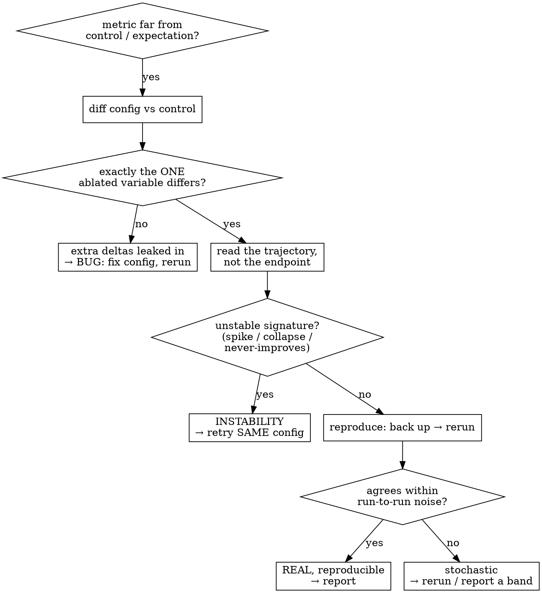

# VERIFY methodology — is the number real?

> **Stance — 用户主权 + 审查→披露.** Research judgment (seed count, which samples to show, whether an aux
> branch exists) belongs to the user. This methodology **audits and discloses tradeoffs ONCE**, then moves
> on — it never mandates a practice or nags. If the user has declared single-seed, state the limitation
> once and stop; don't keep pushing multi-seed. What is enforced is **disclosure, not the fix**: an
> integrity finding (unsplit data, leakage, a number that can't be re-derived) must ride with the result —
> "disclose it, or don't claim it" — but the audit informs the user, it does **not** block delivery.

## Overview

**A surprising experiment number is a hypothesis, not a fact to report.** It is one of three things — an instrumentation/config **bug**, a genuine **effect**, or stochastic **noise** — and you decide which *before* you trust it or discard it. Platform-agnostic methodology; for GPU-rental operations see `references/run-remote/`.

## Universal principles (the 6 invariants that generate every probe below)

1. **A surprising number is a hypothesis** — classify it bug / effect / noise before reporting (§1).
2. **Comparability**: a comparison may change **exactly one** variable; hold data, budget, protocol, metric, split, and seed-handling identical (§1 Probe 1, §5 fair comparison).
3. **Leakage = any test information reaching training *or selection*** — via data, preprocessing order, model selection, or pretraining. Probe the *prepared artifacts* + the pipeline order, not the prep code (§4).
4. **Trust the artifact you loaded, not the claim** — logs, "done" lines, losses, smokes, and single metrics all lie; verify the actual numbers / pixels / bytes (§6, §10, §11).
5. **A proxy is not the target** — train loss, ε-loss, chance-floor metrics, operating points, hand-picked metric variants are proxies; score the quantity you actually claim, on the disjoint **test** split, **with variance** (§7, §9).
6. **Integrity = could a skeptic reproduce this exact number from your released code + data + config?** If not (one-off CLI, no seed, hand-edited table, hidden seeds), it is not a result yet — disclose or don't claim (§11, §13, integrity spectrum).

Two operating invariants throughout: **never mutate the original artifacts while investigating**, and **change inputs only between runs**.

## When to use

- A metric lands far from control/expectation and you don't know if it's real
- Training looks divergent: gradient-norm spike, best-at-first-epoch, early stop, loss plateau
- Output is constant/degenerate across distinct inputs, or `real == shuffle` in a conditioning control
- A result reproduces on train but collapses on val/test
- You suspect leakage, an unfair baseline, or a too-good-to-be-true number
- An eval crashes, hangs, or writes an unexpectedly large artifact tree; or you're sizing eval visualization
- Reproducing a result, or pruning duplicate/orphan tracker runs
- **Before reporting any ablation delta or comparison table**

## When NOT to use

- Results match expectation (nothing to verify)
- Platform/infra faults (disk, SSH, shared FS) → `references/run-remote/` (rented) or `references/run-local/` (own box)
- A model that won't run / converge / fit → the `references/training/` debug layer; pure architecture *design* is out of scope

---

## 1. Classify a surprising result (the core loop) — principle 1+2

**Probe 1 — diff against the control (cheapest, first).** Pull both runs' *resolved* configs; confirm they differ in **exactly the one variable you ablated**. Any extra unexplained delta means the gap is a misconfiguration artifact, not the variable's effect. (The mirror also holds: when a config that *works* differs from a failing one in **≥2 ways at once**, the win is confounded — run one-axis-at-a-time intermediates to find which axis is load-bearing before concluding "X is necessary".)

**Probe 2 — read the trajectory, not the endpoint.**

| Trajectory shape | Verdict |
|---|---|
| Tracks the control, saturates at a **lower ceiling** | Real effect |
| Healthy climb, just a gentler slope | Real effect |
| Early peak then decline / oscillation | Under-converged or unstable → reproduce |
| Never improves past epoch 1; grad-norm spikes far above its healthy band | **Training instability** |

**Probe 3 — reproduce, but back up the original FIRST.** Re-running usually **overwrites** the artifact (especially with auto-sync). Copy the original *before* re-running the **identical** config. Agreement within run-to-run noise (nondeterministic kernels + reduced-precision autocast give a few-percent band) ⇒ real & reproducible. Large disagreement ⇒ stochastic, not a clean datapoint.

## 2. Instability vs genuine effect

Stochastic divergence hits a *fraction* of otherwise-identical runs: the same config succeeds most of the time and occasionally fails with a gradient spike / collapse / far-below-control metric. **Do not rescue one condition with special hyperparameters** (clip, patience, lr) — it destroys comparability and invites "why was this cell different?". Retry the identical config (usually succeeds); if it *persistently* fails, report it as a limitation. Usual contributors: nondeterministic conv kernels, reduced-precision autocast, an aggressive default lr.

## 3. Don't corrupt what you're investigating

Three silent comparability-killers:
1. **Re-running into the original path** — overwrites the result you were comparing against. Back up first.
2. **Editing a script/config a long job is still reading** — runtimes may re-read mid-execution and misbehave. Change inputs only *between* runs.
3. **Giving one condition special settings** — breaks the apples-to-apples comparison. Hold every condition identical.

---

## 4. Leakage — test information reaching training *or selection* (principle 3)

Leakage hides from code review and shows up in the artifacts; **probe the PREPARED data + the pipeline ORDER**, not the prep code. The flagship case: two reviews missed a case-insensitive-filesystem double-ingestion (NTFS/APFS: enumerating `("Train","train")` aliases ONE physical dir → every image ingested twice; a pooled random re-split then scatters the copies across train/test = true leakage — **76 % of one test split had been trained on**; the paper number survived until an artifact probe killed it). The variants, each with its cheap probe:

| Leakage variant | Cheap probe |
|---|---|
| **Case-insensitive-FS / duplicate ingestion** | per split: file count vs unique **normcase** names |
| **Same image across splits** (re-split, near-dups, augmented copies) | pairwise cross-split name intersection; **same-bytes hash on colliding names** (name collision ≠ leakage — two official splits both numbering `1.png` gave 11k collisions, ZERO identical bytes); perceptual-hash / embedding near-neighbor for near-dups |
| **Preprocessing fit on the full set** (scaler / PCA / feature-selection / imputation `fit` on train+test) — the most common, most invisible | every `fit` must see **train only**; assert the transformer never touched val/test |
| **Temporal** (shuffle a time series before splitting; use future to predict past) | split by time; assert `max(train.time) < min(test.time)` |
| **Windowed-feature / lookahead** (a rolling stat, lag, scaler, or target computed across the train/test boundary or fit on the full series; random K-fold on temporal data) | feature windows fit on **train rows only**, never crossing the split; use **walk-forward / expanding-window CV**, not random K-fold |
| **Group / subject** (same patient / scene / speaker in train & test) | group by the entity key; assert `train ∩ test = ∅` on that key |
| **Label / target leakage** (a feature is a proxy for / derived from the label; an ID encodes the class) | does one feature predict the label near-perfectly? drop it and re-measure |
| **Selection-on-test** (tune HP / pick epoch / pick checkpoint on the test split → test becomes val) | selection uses **val only**; the test split is touched **once**, at the end |
| **Pretraining contamination** (test set sits in a foundation model's pretraining corpus; LLM-benchmark contamination) | n-gram overlap / canary string; confirm on a private or post-cutoff set |
| **Non-standard / favorable split** (an easier split than the field's convention) | align to the standard split; report the split provenance |

Memorization tell when leakage is suspected: the old checkpoint's recall on the leaked test split ≫ its recall on truly-unseen images (**seen 0.87 vs unseen 0.22** in the live case). Then the number is unsalvageable by re-eval — **only retraining on clean splits counts**. Manifest entries missing on disk = fabricated rows.

## 5. Fair comparison — every method gets the same chance (principle 2)

An unfair table is a confound (§1 Probe 1) at paper scale. Hold these identical across your method AND every baseline; where you can't, **disclose it**:

- **Tuning / compute / data / epoch / augmentation budget.** Your method fully tuned while a baseline is under-trained = the gap is budget, not method. Give all methods the same HP-search budget; report the protocol.
- **No disadvantage applied only to the baseline.** A handicapped setting (resolution, input size, decode budget, see §7) you don't also impose on yourself invalidates the win.
- **A re-implemented baseline must reach its published number.** If your reproduction is weaker, the low score is a reproduction artifact — fix it or mark the row **cite-only / footnoted**, never present a crippled baseline as faithful.
- **No copied numbers across settings.** Baseline values lifted from a different dataset / split / protocol = apples-to-oranges; re-run under your one protocol or label the difference explicitly.
- **Tricks apply to all or none.** TTA, ensembling, extra pretraining for your method but not baselines is not a fair comparison.
- **Match the cost axis.** A bigger model "winning" on accuracy is not a result unless params / FLOPs / latency are reported and roughly matched (or the trade-off is the point and is shown).
- **Report the full benchmark, not the subset you win.** Selectively reporting only the datasets/tasks where you lead is selective reporting; show the losses too.

## 6. A green smoke is not a correct model (principle 4)

A smoke that asserts only `isfinite(loss)` + output shape passes on code that is **quantitatively wrong but numerically stable** — the most dangerous reproduction bug, because it survives every shallow check (yours *and* a delegated agent's). The traps and their real checks:

- **Train/eval input parity.** A model that builds/normalizes its input differently on the two paths leaks a constant-factor mismatch that stays finite. **Assert train and eval feed the network the identical tensor — same shape *and* scale (`allclose`), not just `isfinite`.** (Typical cause: a normalization one path applies and the other skips.)
- **Normalization & units (the quiet result-killers).** ① Image-norm mismatch (trained with ImageNet mean/std but eval fed `[0,1]`; or RGB/BGR swapped). ② Output **not de-normalized** before the metric (regression scored in z-space and reported as real units). ③ BatchNorm running stats never updated (`num_batches_tracked==0`) or updated using test data. ④ Eval left in **train mode** (dropout / BN-batch-stats on) inflates or corrupts the metric — assert `model.eval()`.
- **Gradient flow after a substitution.** Swapping a pretrained backbone for random-init, or adding a zero-init stabilizer, can silently freeze most of the net. After one backward, **count parameter tensors receiving a non-zero gradient** — expect ~all (e.g. 64/64, not 7/64). (Same probe catches a misplaced `detach()` / `requires_grad=False` training a frozen module or freezing a live one.)
- **A synthetic-signal test is too easy.** "Planted a strong low-rank signal; it survives the module" passes on a module that destroys *real* structured content. Probe a content-preservation claim on **REAL held-out data**.
- **An identity / trivial shortcut.** An autoencoder that copies input→output, or a model exploiting a degenerate solution the loss happens to reward, scores well while learning nothing — perturb the input and confirm the output actually follows.
- **Delegated smokes prove even less.** A subagent reporting "smoke passed, loss finite" verified neither scale nor math. The controller **re-verifies independently** — read the load-bearing code path and check the numbers, not the exit status.

## 7. Localize where the signal dies before theorizing (principle 5)

An end-to-end failure (downstream task at chance) has many candidate causes; **don't reach for the hardest explanation ("the task is too hard") until a cheap probe ladder shows where the signal actually dies.**

- **Input ceiling.** A *held-out* linear probe on the raw input (pre-module) bounds the content available downstream. Chance here ⇒ the signal isn't in the input — stop blaming the model. (Held-out 70/30, not a least-squares fit to its own rows — that reports memorization.)
- **Per-stage probe.** Feed each module's output to the same probe; a big drop localizes the destroyer — *even at random init*.
- **Task-vs-method control.** Method fails on the target task? Rerun on an easy task with *verified-high* input content (e.g. MNIST raw-probe ≫ chance). Still failing ⇒ the method is broken, not the task hard.
- **A metric pinned at its chance floor carries zero gradient — don't tune against it.** InfoNCE resting at `ln(batch)`, retrieval at `1/batch`: the objective sees nothing to separate (frequent cause: targets degenerate for the objective — per-instance contrast where in-batch items share a class). Measure the quantity you care about (a content-decodability probe), not the dead proxy.
- **Templated-answer trap.** A low *training* loss with a templated answer ("The digit is 7") is dominated by format tokens — the one answer token can sit at chance under a low loss. Judge by a held-out **answer-span** metric (real-vs-shuffle), never train loss.
- **Report the decisive metric on TEST, not val — and sanity-check the chance floor.** A real-vs-shuffle gap on *val* is valid for the relative screen, but the paper number belongs on the disjoint **test** partition. Tell-tale: if the shuffle baseline on val sits *below* chance (10-way shuffle = 0.03 when chance is 0.10), the val baseline is an optimistic artifact — re-run on test (`--split test`), where shuffle ≈ chance and the gap is honest (usually smaller but real).
- **Confirm a real held-out val split EXISTS — the "val" curve may be the last training batch.** A common silent flaw: `train.py` reports a per-epoch "val" metric computed on the **last training batch** (or re-uses the train loader), so no disjoint validation exists and the TB "val" trajectory is a *train-fit* curve that validates nothing — it cannot catch overfitting or collapse, and every verdict read off it is suspect. Assert the val loader draws from a split disjoint from train; validate verdicts by **render / test-split eval**, not the in-loop "val" scalar.
- **"Empty results" is NOT "n.s."** A scorer built for one dataset (MNIST digit-logit, which *skips non-digit golds*) scores **0 samples** on another → JSON reads `results: {}` / "0 scored", meaning *the metric didn't apply* — not `gap≈0, n.s.`. Generalize the scorer with a regression guard, and always check the produced **`n`** before reading a gap.
- **All-zero structured metrics ⇒ check task GEOMETRY before model/gradient/normalization.** `mAP=0` AND `mIoU=0` AND `label-acc=0` *simultaneously* while loss *decreases* is the "zero predictions emitted" signature. Two cheap geometry checks first: (a) **object-vs-frame** — a digit upscaled to 14 px on a 128 px canvas = 11 % of the frame, near-undetectable in a few epochs; (b) **grid-vs-object** — a stride-32 head on 128 px = a 4×4 heatmap, too coarse for one small object. A flat-but-growing heatmap below the decode threshold yields all-zero metrics and is *expected* under-training, not a bug.
- **Changing input resolution silently breaks every resolution-coupled hyperparameter** (object scale, detection stride, anchors, RoI sizes). Bumping 32 → 128 shrinks the *relative* object and coarsens the grid — a one-line edit that manufactures an all-zero metric. Re-audit every size expressed in pixels or strides, one variable at a time.
- **Same checkpoint, two very different scores ⇒ diff the METRIC PIPELINE before believing either.** A trainer-val mAP50 of 0.27 vs a standalone-eval 0.04 on the SAME weights was 100 % decode-budget asymmetry: the evaluator's "paper" budget (top-k 10, score floor 0.40) guillotined a weak-confidence model whose detections sat at 0.40–0.51, while the trainer validated under k 30 / floor 0.02 — re-evaluating under the trainer's budget reproduced 0.264 vs 0.266. Fingerprint: predictions-per-image histogram pinned at {0, 1} with GT intact. Diff decode k / score floor / NMS, AND the split, AND the protocol identity before narrating "generalization collapse". An mAP with a high score floor is an *operating point*, not mAP. Corollary: a whole "weak cross-domain" table can be one budget artifact repeated per row.

## 8. Representation collapse: a model that ignores its input (principle 5)

A net mapping a low-level input to a structured output whose output is near-identical across *distinct* inputs is **ignoring its input**, not learning slowly. Fastest fingerprint: **output cross-sample cosine ≈ 1.0** (or `real == shuffle` in a conditioning control). The decisive, counterintuitive lessons:

- **Diagnose at the INPUT, render the intermediate.** Check **input** cross-sample cosine; ≈1.0 ⇒ inputs are invariant-dominated (a DC/low-freq offset swamps a tiny discriminative residual). Then *render* the artifact (load the small front module on CPU) and LOOK — proxies lie in both directions (a low recon loss AND a climbing cosine both misled while the image settled it in seconds).
- **Fix at the INPUT, not the OUTPUT.** Normalize the network input — per-feature **standardization** (z-score, train stats in saved buffers) or per-sample LayerNorm. (Term precision: *standardization* — per-feature zero-mean/unit-variance, no decorrelation — **not** *whitening*/ZCA, rarely needed here.) A de-collapse head on the *output* only amplifies the collapsed residual to satisfy its own loss. A physics/`[0,1]` preprocessing scalar is **not** input normalization.
- **An architecture-invariant failure is a data/input bug — stop redesigning.** When the SAME signature (collapse / `real==shuffle` / chance floor) survives *every* architecture change (frozen vs LoRA, encoder A vs B, with/without aux head), the cause is upstream. Freeze the architecture and **diff the INPUT against a working sibling**.
- **Train-ok / val-collapsed ⇒ per-split input-distribution mismatch**, not the model. Dump per-split input stats (sampling rate, per-feature std, cross-sample cosine). A *per-sample* input norm survives this; a norm baking in *train* dataset statistics does not.
- **Kill a collapsing run in epoch 1.** Cosine pinned near 1.0 + predictions piling on one class ⇒ it will not recover; early-stop instead of paying for a multi-hour run to a foregone `real==shuffle`.

**Deep playbook with the full worked diagnosis → `references/verifying/representation-collapse.md`.**

## 9. Metric & statistical integrity (principle 5)

A number without variance or a fair metric is not yet evidence:

- **Variance, or a disclosed lack of it.** Report **mean ± std over ≥3 seeds when possible** — a band turns a single anecdote into evidence; **high-variance regimes (RL, small or noisy test sets) need ≥5+ seeds and a robust aggregate (IQM, not the mean) with CIs** (`references/training/by-domain.md` R6). If the user has chosen single-seed, that's their call: disclose "single-seed, no variance band — a delta inside run-to-run noise can't be told from signal" **once**, with the number, and move on; don't keep pushing for more seeds. Log the seed + determinism flags either way.
- **An improvement inside the noise is not an improvement.** Overlapping error bars / no significance test ⇒ "SOTA by 0.1 %" is noise. **Name which variance you show: a paired bootstrap over the *test items* is sampling variance (valid even at one seed); std over seeds is *init/optimization* variance — different questions.** For a method-vs-baseline delta a **paired test on per-item scores** is tighter than two independent bands; a tiny test set reported to 3 decimals is false precision (report `n`).
- **Don't cherry-pick the metric variant.** Reporting `mIoU` while hiding `PA`, `AP@0.5` while hiding `AP@[.5:.95]`, `PSNR` while hiding `LPIPS` is gaming — report the field's standard panel.
- **A metric can be DECEPTIVELY HIGH for a trivial output on sparse / class-imbalanced data.** PSNR/SSIM and background-averaged multiclass mIoU reward matching the dominant background, so an all-black / all-background prediction scores *well*, not zero (an all-black digit ≈10 dB PSNR / SSIM ~0.44; multiclass mIoU floored by its background class) — and a collapsing model (§8) is rewarded *toward* that trivial optimum. Score **foreground-scoped** metrics (foreground-PSNR, foreground- or binary-IoU) AND **render** the output; never trust a high scalar on sparse data without looking. (Distinct from §7's all-*zero* metric: there the model emits nothing; here it emits the trivial majority and the metric applauds.)
- **An operating point is not a threshold-free metric** (§7 decode-budget case): a threshold chosen on test, reported as mAP/F1, is selection-on-test (§4).
- **Multiple-comparisons / p-hacking.** Trying many configs and reporting only winners inflates false positives — report how many were tried (or pre-register), and prefer held-out confirmation.

## 10. Evaluation artifacts have hidden cost (principle 4)

Per-sample visualization scales as **samples × conditions** and triggers three independent failures on large eval sets:
1. **Plotting-library dimension caps** — a tall composite grid can exceed the backend's max image dimension and abort; if the plot runs *before* the metric-summary write, you lose the summary too.
2. **File-count / inode limits** — thousands of small images exhaust shared-storage inode quotas long before byte quotas.
3. **Transfer time** — many-small-files copy is dominated by per-file round-trips.

Size per-sample output to the set (cap on large, full on small); cap aggregate composite plots regardless. **The metric summary is the asset**; per-sample images are optional and prunable.

**A figure that *saved* is not a figure that's *correct*.** `savefig` returning cleanly means the file exists, not that it's readable — re-open the rendered PNG and look at the pixels. Silent visual failures pass every code check: CJK/Unicode glyphs rendered as `□` tofu, axis labels clipped past the canvas, panels overlapping, or a plot that *renders perfectly while misrepresenting* (a mean-only bar over n=3, a **truncated y-axis** exaggerating a gap, a log axis flattening the very effect). This is §11 applied to pixels — trust the loaded image, not `savefig`'s exit code. (Axis-truncation and hidden-failure curves are also where honest plotting shades into misconduct — see the integrity spectrum below.)

## 11. Trust artifacts, not log lines (principle 4)

"done" / "synced" / "saved" messages lie when the underlying write failed silently (full disk, exhausted inodes, a swallowed error code). Confirm the file **exists and loads** before believing it; keep the upstream copy authoritative until a downstream copy is verified.

The flip side: artifacts are the **provenance record**. An eval manifest that embeds the resolved CLI overrides answers "what protocol produced this column?" — a mystery result cell (an OOD eval defined by seven one-off `-o` flags, nowhere in the repo) was reconstructed verbatim from its `*_manifest.json`. Two rules: read the manifest before guessing a historical protocol; and **a protocol that exists only as a one-off CLI string is unreproducible — freeze it as a config file the moment you find it** (principle 6).

## 12. Experiment-tracker forensics

A tracker's API/exports turn "stare at dashboards" into scriptable checks. Four operations cover most verification + cleanup:

| Operation | Use |
|---|---|
| List runs (state, created, key metric) | spot duplicates, orphans, crashed runs |
| Diff two runs' configs | Probe 1 |
| Pull a metric's per-step history | Probe 2 |
| Delete a run | remove duplicates/orphans (deletion often lags — re-confirm) |

Bundled wandb implementation: `scripts/wandb_forensics.py` (adapt for tensorboard/mlflow/trackio). Two SSH portability traps: f-strings can't contain a backslash; single-quote the heredoc (`<< 'EOF'`) or the remote shell rewrites every `$var`.

**Ask the tracker for the artifact TYPE — don't grep event files.** To check whether a run logged a *figure* vs only *scalars*, hit the typed endpoint (TensorBoard: `/data/plugin/images/tags` for `add_figure`, `/data/runs` for scalars) — not a substring grep over the binary events. `epoch_samples/cls` is a prefix of BOTH the figure tag AND the `epoch_samples/cls/unique_pred_count` scalar, so a grep "confirms" a figure that was never written — and you report a fix that didn't land. The typed API is the artifact; the grep is a log line (§11).

## 13. Checkpoint hygiene & reproducibility

Keep the **selection-criterion** checkpoint (the "best" by your metric). Periodic snapshots and last-step/resumption checkpoints are disposable scratch — delete after a run to reclaim space (a sweep can leave 100s of GB of superseded `latest.pt` while the actual result is <1 GB of metric JSON). Reproducibility floor: **seed + determinism flags logged; environment/versions frozen (`requirements`/lockfile) and hardware noted; released code must reproduce the paper number from its README** — a result that only the author's machine produces is not yet a result (principle 6).

## 14. Cross-document number reconciliation (principle 4 + 6)

One result lives in many places — paper, thesis, slides, rebuttal, README, results CSV, and the checkpoint it was computed from — and a fix in one rarely propagates to the rest, so an already-debunked number keeps shipping. (Four real shapes, de-identified: an inflated metric typo corrected in the paper but still surviving in the slides; a method renamed in the text yet left under its old name in three figures; a headline number mislabeled with the wrong rate/setting; a README citing an old metric long after the code moved on.) Treat every reported scalar / name / citation key as one **truth value** with a single authoritative source:

- **One source of truth = the artifact it is computed from** (results JSON / checkpoint eval), not whichever document was edited last. Re-derive the headline from that artifact (principle 1) before trusting any document's copy of it.
- **Diff the shared values across all artifacts before submission.** Grep each reported number / method name / dataset size / citation across paper + thesis + slides + rebuttal + README + CSV; every occurrence must match the source. **A correction is not done until it lands in all of them.**
- **Highest-drift items**: the lead metric and its delta, method / dataset names, param·FLOP counts, sampling rate / compression ratio, and *any number that was ever corrected* (a corrected number is the one most likely still stale somewhere).

This is principle 4 (trust the artifact, not a document's copy of it) and principle 6 (a number you cannot re-derive is not a result) applied across the whole corpus.

---

## Academic-integrity spectrum (where the probes above also bite)

The same probes that catch honest bugs also expose and deter the rest of the spectrum:

**honest bug → negligence (didn't check) → QRP (cherry-pick seed / p-hack / HARKing / selective reporting) → FFP (fabrication / falsification / plagiarism).**

This skill mainly catches **bugs + negligence**, but **test-set tuning (§4), unfair comparison (§5), hidden seeds / no-variance (§9), a one-off-CLI ghost number (§11), and a truncated-axis or hidden-failure plot (§10)** are exactly the QRP/FFP tells. Operating rule for anything integrity-relevant: **disclose it, or don't claim it.** HARKing (presenting a post-hoc finding as a priori) and file-drawering failed seeds are QRPs even when every number is real. Figure duplication/splicing → §10 visual check; citation/attribution integrity → `citation-hygiene`.

---

## Common mistakes

| Mistake | Fix |
|---|---|
| Report a surprising metric without a control-diff | diff first; only the ablated variable should change |
| Judge by the endpoint metric alone | read the trajectory |
| Re-run into the original artifact path | back it up first |
| Special hyperparameters to "fix" one condition | keep all conditions identical; retry same config |
| Declare splits leakage-free from reading the prep code | probe the PREPARED artifacts: dup normcase names, cross-split intersections, same-bytes hash, fit-on-train-only, group/time/label/pretrain leakage (§4) |
| Read cross-split name collisions as leakage (or as proof of it) | names are not bytes — hash the colliders; official splits can share numbering with zero shared images |
| Tune HP / pick epoch / pick checkpoint on the test split | that is selection-on-test leakage; select on val, touch test once |
| Compare a fully-tuned method to an under-trained baseline | equal budget/epochs/data/aug + matched params·FLOPs; reach the baseline's published number or mark cite-only (§5) |
| Copy baseline numbers from a different setting/split | re-run under one protocol or label the difference |
| A green smoke ⇒ a correct model | `isfinite(loss)` survives scale/gradient bugs — assert train≡eval input (`allclose`) + gradient flow (64/64) + `model.eval()` |
| Metric computed in normalized/z-space or wrong image-norm/channel order | de-normalize before scoring; one shared transform; check ImageNet-vs-[0,1], RGB/BGR |
| Report a single (or best) seed | mean ± std over ≥3 seeds; an improvement inside the error bars is noise (§9) |
| Cherry-pick the favorable metric variant | report the field's standard panel (mIoU+PA, AP@[.5:.95], LPIPS) |
| "The task is too hard" before a probe ladder | probe the raw-input ceiling + each stage (held-out); retry on a strong-signal easy task |
| Tune against a metric at its chance floor (`ln B` / `1/B`) | dead proxy, no gradient — measure the quantity you care about directly |
| Read a low *training* loss as task success | templated answers hide a chance-level answer span; judge by a held-out answer-span metric |
| Report the decisive gap on the val split | val baselines can sit below chance (optimistic artifact); report on the disjoint TEST split — same ckpt, `--split test` |
| Read the per-epoch "val" curve as validation | confirm a disjoint val split exists — many trainers "validate" on the last training batch; the curve is train-fit and catches nothing (§7) |
| Trust a high PSNR/SSIM/mIoU on sparse/imbalanced data | background-matching inflates it — an all-black/all-bg output scores high, not zero; report foreground-scoped metrics + render (§9) |
| Read `results: {}` / "0 scored" as `n.s.` | the task-specific scorer didn't apply; generalize it + check the produced `n` |
| Output identical across distinct inputs ⇒ blame the task | it ignores its input — check INPUT cosine, standardize the input, RENDER the artifact (§8) |
| `mAP=0 & mIoU=0 & label-acc=0` together ⇒ hunt a gradient/norm bug | all-zero detection = no predictions; check object-vs-frame size + stride-vs-object grid FIRST (§7) |
| Change input resolution, leave object scale / stride untouched | resolution-coupled hyperparameters silently break; re-audit every pixel/stride size |
| Explain a val-vs-eval gap as "generalization" before diffing the metric pipeline | same ckpt scored 0.27 vs 0.04 purely from decode budget; diff k/threshold/NMS + split + protocol |
| Full per-sample vis on a large eval set | cap it; cap aggregate plots too |
| Trust a "saved/synced" line | verify the artifact exists and loads |
| A result that only runs from a one-off CLI string | freeze it as a config; unseeded/unfrozen-env numbers aren't reproducible (§13) |
| Correct a number in one place, leave it stale in the paper/slides/README/CSV | one truth value per number = its source artifact; diff every reported number/name/citation across all docs before submit (§14) |
| Call a model "diverging/broken" from a smoke-length run | extend 10–50×: undertraining CLIMBS, a real bug stays degenerate / explodes — read the LOSS VALUE (→ ±∞ or negative = invalid-math bug) |
| Call the job "stalled" from ~0% accelerator util | idle ≠ stalled — if the step counter ADVANCES, the bottleneck is UPSTREAM (CPU data-prep / I/O); profile and relocate THAT |
| Read 100% accelerator-util as "fully fed" | "util" = "≥1 kernel ran in the window," not useful work — correlate SM clock + power over seconds; low SM clock at 100% = underfed |
| Read a low generative/diffusion training loss as success | a low ε / denoise loss ≠ good samples — score the SAMPLED output; denoise a real `x_t` to localise sampler vs model |

**Smoke-length runs hide several distinct failures — undertraining vs a loss-math bug vs a degenerate model, the generative training-loss-vs-sample gap, decode-scale, and the local-OOM hazard → `references/verifying/smoke-hidden-failures.md`.**

## Red flags — STOP

- "The metric is bad, so the change hurts" — before control-diff + reproduce
- "I'll just re-run in place" — without backing up the original
- "One safeguard just for this condition" — comparability drift
- Reasoning from an endpoint number without ever seeing the curve
- Splits declared clean from reading prep code — probe the prepared artifacts (§4)
- Selecting epoch / checkpoint / HP on the test split
- A baseline weaker than its paper, or run at a budget/setting you don't impose on yourself
- A headline number from a single (or hand-picked) seed, or a win inside the error bars
- A per-epoch "val" metric with no disjoint val loader — it is the training batch; the curve validates nothing
- A high PSNR/SSIM/mIoU on sparse/imbalanced data taken at face value — background-matching inflates it; render + score foreground
- Acting on a success log line without verifying the artifact landed
- A delegated/own "smoke passed (finite)" taken as proof — without input-scale parity, gradient flow, and `model.eval()`
- "It fails because the task is hard" — before a raw-input ceiling probe + strong-signal easy-task control
- Optimizing a loss/retrieval metric sitting exactly at its chance floor
- A net whose output (or rendered intermediate) is identical across distinct inputs — normalize the input and diff a working sibling before blaming task or architecture
- The same failure signature survived your last 2+ architecture changes — it's upstream; stop redesigning, diff the input
- "I'll add a reconstruction/diversity head to de-collapse it" — input-caused collapse; standardize the INPUT first
- Constructing / forwarding / training / **sampling** a real model on the LOCAL dev box — it OOMs the workstation (a 128² diffusion model exhausted a 128 GB box); heavy DL runs on the GPU instance, local = static checks only
- A generative model's training loss is low so "it works" — without scoring a SAMPLED output (an ε-loss of 0.04 has co-occurred with 3 dB samples)
- A val/test gap narrated as "poor generalization" before decode budget, split identity, and protocol are diffed
- Comparing or deleting "duplicate" data by filename alone — hash the bytes; collisions ≠ copies
- A number you cannot reproduce from released code+config, or an integrity-relevant choice (unfair compare / test-tuning / hidden seeds) left undisclosed — disclose or don't claim
- A reported number / method name / citation that differs across paper, slides, README, or CSV — reconcile every copy to its source artifact before submitting (§14)
